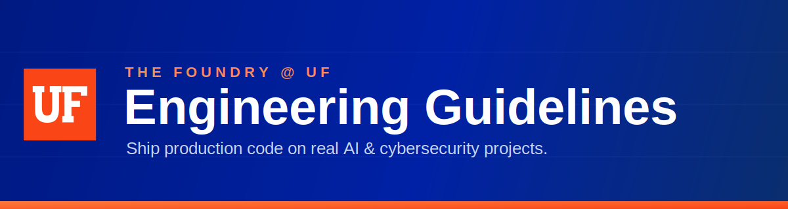
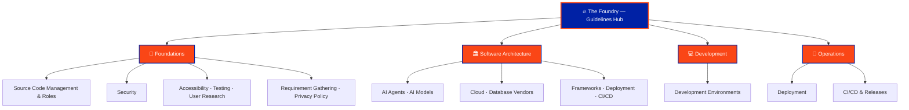

 

---

## 🔥 What is The Foundry?

**The Foundry @ UF** is an accelerated engineering experience where students **ship production code to real users** on real **AI** and **cybersecurity** projects. Students move from onboarding to contributing to mentoring — writing features with 80%+ test coverage, running peer code reviews, and leading initiatives from proposal to deployment.

This repository is the **central navigation hub** for every engineering guideline in The Foundry. Pick a category below to jump to its guidelines.

---

## 📚 Categories

<table>
  <tr>
    <td width="50%" valign="top">

### 🧱 [Foundations](./foundations/)
Core engineering practices used across The Foundry — source control, security, testing, accessibility, and more.

`7 guidelines`

</td>
    <td width="50%" valign="top">

### 🏛️ [Software Architecture](./architecture/)
System design for scalable production systems — AI agents & models, cloud, databases, and frameworks.

`7 guidelines`

</td>
  </tr>
  <tr>
    <td width="50%" valign="top">

### 💻 [Development](./development/)
Development environments and the day-to-day workflows that keep contributors productive.

`1 guideline`

</td>
    <td width="50%" valign="top">

### 🚀 [Operations](./operations/)
Shipping to production — deployment, CI/CD, and release management.

`2 guidelines`

</td>
  </tr>
</table>

---

## 🗺️ Site Map

---

**The Foundry @ UF**
_Accelerating Innovation and Impact through Agentic Effort_

🟦 `#0021A5` &nbsp;&nbsp; 🟧 `#FA4616`

